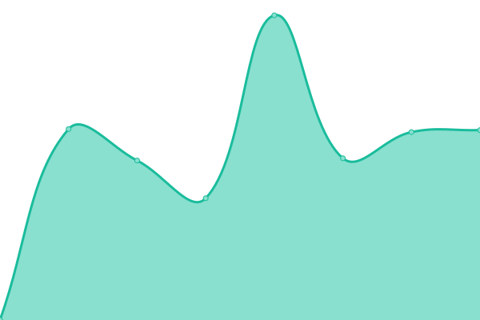
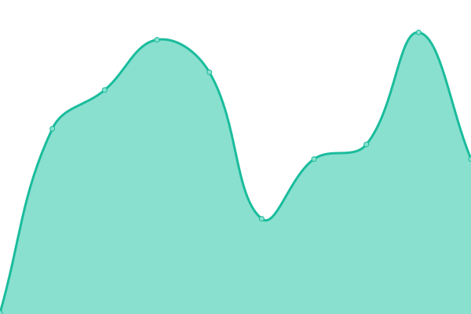

# [📈 Live Status](https://tiekoetter.github.io/uptime): <!--live status--> **🟩 All systems operational**

This repository contains the open-source uptime monitor and status page for [Léon Tiekötter](https://www.tiekoetter.com), powered by [Upptime](https://github.com/upptime/upptime).

With [Upptime](https://upptime.js.org), you can get your own unlimited and free uptime monitor and status page, powered entirely by a GitHub repository. We use [Issues](https://github.com/tiekoetter/uptime/issues) as incident reports, [Actions](https://github.com/tiekoetter/uptime/actions) as uptime monitors, and [Pages](https://tiekoetter.github.io/uptime) for the status page.

<!--start: status pages-->
<!-- This summary is generated by Upptime (https://github.com/upptime/upptime) -->
<!-- Do not edit this manually, your changes will be overwritten -->
<!-- prettier-ignore -->
| URL | Status | History | Response Time | Uptime |
| --- | ------ | ------- | ------------- | ------ |
|  [Tiekoetter.NET](https://www.tiekoetter.net) | 🟩 Up | [tiekoetter-net.yml](https://github.com/tiekoetter/uptime/commits/HEAD/history/tiekoetter-net.yml) | 

 815ms
     
 | 

<a href="https://status.tiekoetter.cloud/history/tiekoetter-net">99.90%</a>
    

|  [AS.Tiekoetter.NET (AS208694)](https://www.as.tiekoetter.net) | 🟩 Up | [as-tiekoetter-net-as-208694.yml](https://github.com/tiekoetter/uptime/commits/HEAD/history/as-tiekoetter-net-as-208694.yml) | 

 677ms
     
 | 

<a href="https://status.tiekoetter.cloud/history/as-tiekoetter-net-as-208694">99.96%</a>
    

|  [Tiekoetter.com](https://www.tiekoetter.com) | 🟩 Up | [tiekoetter-com.yml](https://github.com/tiekoetter/uptime/commits/HEAD/history/tiekoetter-com.yml) | 

 1092ms
     
 | 

<a href="https://status.tiekoetter.cloud/history/tiekoetter-com">100.00%</a>
    

|  [CDN (tiekoetter.cloud)](https://test.cdn.tiekoetter.cloud) | 🟩 Up | [cdn-tiekoetter-cloud.yml](https://github.com/tiekoetter/uptime/commits/HEAD/history/cdn-tiekoetter-cloud.yml) | 

 105ms
     
 | 

<a href="https://status.tiekoetter.cloud/history/cdn-tiekoetter-cloud">99.88%</a>
    

|  [ns1.tiekoetter.net](ns1.tiekoetter.net) | 🟩 Up | [ns1-tiekoetter-net.yml](https://github.com/tiekoetter/uptime/commits/HEAD/history/ns1-tiekoetter-net.yml) | 

 118ms
     
 | 

<a href="https://status.tiekoetter.cloud/history/ns1-tiekoetter-net">100.00%</a>
    

|  [ns2.tiekoetter.net](ns2.tiekoetter.net) | 🟩 Up | [ns2-tiekoetter-net.yml](https://github.com/tiekoetter/uptime/commits/HEAD/history/ns2-tiekoetter-net.yml) | 

 117ms
     
 | 

<a href="https://status.tiekoetter.cloud/history/ns2-tiekoetter-net">100.00%</a>
    

|  [ns3.tiekoetter.net](ns3.tiekoetter.net) | 🟩 Up | [ns3-tiekoetter-net.yml](https://github.com/tiekoetter/uptime/commits/HEAD/history/ns3-tiekoetter-net.yml) | 

 140ms
     
 | 

<a href="https://status.tiekoetter.cloud/history/ns3-tiekoetter-net">100.00%</a>
    

|  [ns4.tiekoetter.net](ns4.tiekoetter.net) | 🟩 Up | [ns4-tiekoetter-net.yml](https://github.com/tiekoetter/uptime/commits/HEAD/history/ns4-tiekoetter-net.yml) | 

 112ms
     
 | 

<a href="https://status.tiekoetter.cloud/history/ns4-tiekoetter-net">100.00%</a>
    

|  [searx.tiekoetter.com](https://searx.tiekoetter.com) | 🟩 Up | [searx-tiekoetter-com.yml](https://github.com/tiekoetter/uptime/commits/HEAD/history/searx-tiekoetter-com.yml) | 

 754ms
     
 | 

<a href="https://status.tiekoetter.cloud/history/searx-tiekoetter-com">100.00%</a>
    

|  [invidious.tiekoetter.com](https://invidious.tiekoetter.com) | 🟩 Up | [invidious-tiekoetter-com.yml](https://github.com/tiekoetter/uptime/commits/HEAD/history/invidious-tiekoetter-com.yml) | 

 682ms
     
 | 

<a href="https://status.tiekoetter.cloud/history/invidious-tiekoetter-com">100.00%</a>
    

|  [forum.iekoetter.com](https://forum.tiekoetter.com) | 🟩 Up | [forum-iekoetter-com.yml](https://github.com/tiekoetter/uptime/commits/HEAD/history/forum-iekoetter-com.yml) | 

 935ms
     
 | 

<a href="https://status.tiekoetter.cloud/history/forum-iekoetter-com">100.00%</a>
    

|  [bin.tiekoetter.com](https://bin.tiekoetter.com) | 🟩 Up | [bin-tiekoetter-com.yml](https://github.com/tiekoetter/uptime/commits/HEAD/history/bin-tiekoetter-com.yml) | 

 682ms
     
 | 

<a href="https://status.tiekoetter.cloud/history/bin-tiekoetter-com">100.00%</a>
    

|  [wikiless.tiekoetter.com](https://wikiless.tiekoetter.com) | 🟩 Up | [wikiless-tiekoetter-com.yml](https://github.com/tiekoetter/uptime/commits/HEAD/history/wikiless-tiekoetter-com.yml) | 

 1103ms
     
 | 

<a href="https://status.tiekoetter.cloud/history/wikiless-tiekoetter-com">100.00%</a>
    

|  [nitter.tiekoetter.com](https://nitter.tiekoetter.com) | 🟩 Up | [nitter-tiekoetter-com.yml](https://github.com/tiekoetter/uptime/commits/HEAD/history/nitter-tiekoetter-com.yml) | 

 535ms
     
 | 

<a href="https://status.tiekoetter.cloud/history/nitter-tiekoetter-com">100.00%</a>
    

|  [redlib.tiekoetter.com](https://redlib.tiekoetter.com) | 🟩 Up | [redlib-tiekoetter-com.yml](https://github.com/tiekoetter/uptime/commits/HEAD/history/redlib-tiekoetter-com.yml) | 

 783ms
     
 | 

<a href="https://status.tiekoetter.cloud/history/redlib-tiekoetter-com">100.00%</a>
    

|  [translate.tiekoetter.com](https://translate.tiekoetter.com) | 🟩 Up | [translate-tiekoetter-com.yml](https://github.com/tiekoetter/uptime/commits/HEAD/history/translate-tiekoetter-com.yml) | 

 847ms
     
 | 

<a href="https://status.tiekoetter.cloud/history/translate-tiekoetter-com">100.00%</a>
    

|  [lt27.de](https://lt27.de) | 🟩 Up | [lt27-de.yml](https://github.com/tiekoetter/uptime/commits/HEAD/history/lt27-de.yml) | 

 179ms
     
 | 

<a href="https://status.tiekoetter.cloud/history/lt27-de">99.98%</a>
    

|  [searx-instances.tiekoetter.com](https://searx-instances.tiekoetter.com) | 🟩 Up | [searx-instances-tiekoetter-com.yml](https://github.com/tiekoetter/uptime/commits/HEAD/history/searx-instances-tiekoetter-com.yml) | 

 294ms
     
 | 

<a href="https://status.tiekoetter.cloud/history/searx-instances-tiekoetter-com">100.00%</a>
    

|  [leontiekoetter.de](https://www.leontiekoetter.de) | 🟩 Up | [leontiekoetter-de.yml](https://github.com/tiekoetter/uptime/commits/HEAD/history/leontiekoetter-de.yml) | 

 987ms
     
 | 

<a href="https://status.tiekoetter.cloud/history/leontiekoetter-de">100.00%</a>
    

|  [craftsmany.net](https://www.craftsmany.net) | 🟩 Up | [craftsmany-net.yml](https://github.com/tiekoetter/uptime/commits/HEAD/history/craftsmany-net.yml) | 

 1259ms
     
 | 

<a href="https://status.tiekoetter.cloud/history/craftsmany-net">100.00%</a>
    

|  [ts.craftsmany.net TeamSpeak 3 Server](ts.craftsmany.net) | 🟩 Up | [ts-craftsmany-net-team-speak-3-server.yml](https://github.com/tiekoetter/uptime/commits/HEAD/history/ts-craftsmany-net-team-speak-3-server.yml) | 

 945ms
     
 | 

<a href="https://status.tiekoetter.cloud/history/ts-craftsmany-net-team-speak-3-server">100.00%</a>
    

|  [fehling.me [Owner: Luke Fehling]](https://fehling.me) | 🟩 Up | [fehling-me-owner-luke-fehling.yml](https://github.com/tiekoetter/uptime/commits/HEAD/history/fehling-me-owner-luke-fehling.yml) | 

 714ms
     
 | 

<a href="https://status.tiekoetter.cloud/history/fehling-me-owner-luke-fehling">100.00%</a>
    

<!--end: status pages-->

[**Visit our status website →**](https://tiekoetter.github.io/uptime)

## 📄 License

- Powered by: [Upptime](https://github.com/upptime/upptime)
- Code: [MIT](./LICENSE) © [Léon Tiekötter](https://www.tiekoetter.com)
- Data in the `./history` directory: [Open Database License](https://opendatacommons.org/licenses/odbl/1-0/)
